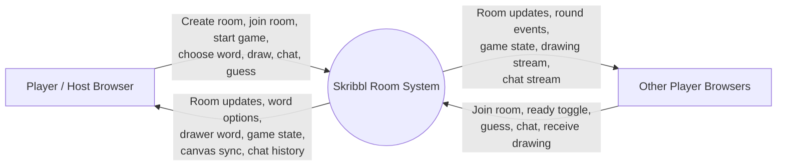
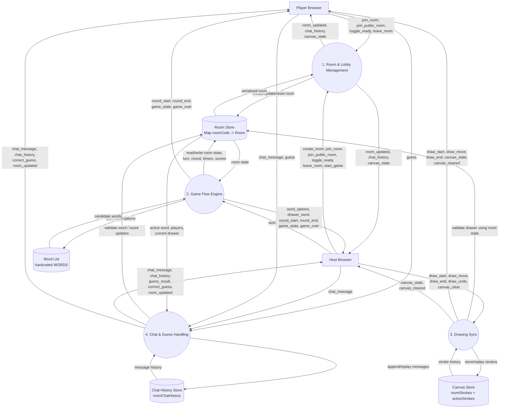

# Data Flow Diagram

This project is a real-time multiplayer drawing game with a React client and a Socket.IO/Express server. The backend is the single source of truth for room state, game state, drawing data, and chat history.

## Context DFD

## Level 1 DFD

## Process Notes

- `1. Room & Lobby Management`
  Handles `create_room`, `join_room`, `join_public_room`, `toggle_ready`, `leave_room`, host reassignment, and lobby resets.
- `2. Game Flow Engine`
  Handles round preparation, word selection, hint reveal timing, score progression, round end, and game over.
- `3. Drawing Sync`
  Accepts drawing input only from the active drawer and broadcasts/replays canvas state to the room.
- `4. Chat & Guess Handling`
  Stores chat history, validates guesses against the active word, awards points, and emits guess/chat updates.

## Data Stores

- `Room Store`
  In-memory `Map<string, Room>` in `skribbl-server/src/index.ts`
- `Canvas Store`
  In-memory `roomStrokes` and `activeStrokes`
- `Chat History Store`
  In-memory `roomChatHistory`
- `Word List`
  Current hardcoded `WORDS` array

## Source Mapping

- Backend entry and event handling: `skribbl-server/src/index.ts`
- Room lifecycle helpers: `skribbl-server/src/game/roomManager.ts`
- Derived game state and hint logic: `skribbl-server/src/game/gameEngine.ts`
- Client room/game orchestration: `skribbl-client/src/hooks/useGameRoom.ts`
- Client socket contract: `skribbl-client/src/socket/index.ts`
